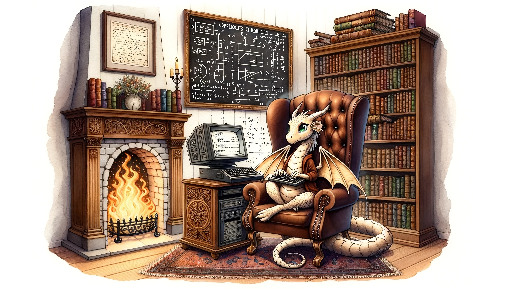

# 🏠 Welcome to my ~(/hoʊm/)

I am pursuing my Master's degree in [Computer Science at Seoul National University](https://cse.snu.ac.kr/en) under the supervision of [Professor Kwangkeun Yi](http://kwangkeunyi.snu.ac.kr/).
Before this, I completed my undergraduate studies in Electrical and Computer Engineering at the same university.

## 📚 Interests
- 🎓 Programming language semantics and static analysis
- 🤖 Functional programming
- 📱 iOS & macOS development
- 📜 Professional typesetting with LaTeX
- Anything in the field of computer science & programming that draws my interest!

## 🛠 Skills
Professional:
  
  
  
  
  

Proficient:
  
  
  
  
  
  
  

## 📊 Some stats

  

## 🔗 Links
- https://zetablog.io (personal blog in Korean)
- http://ropas.snu.ac.kr/~jhlee/
- [Curriculum Vitae](https://github.com/Zeta611/curriculum-vitae/raw/main/build/default/default.pdf)
